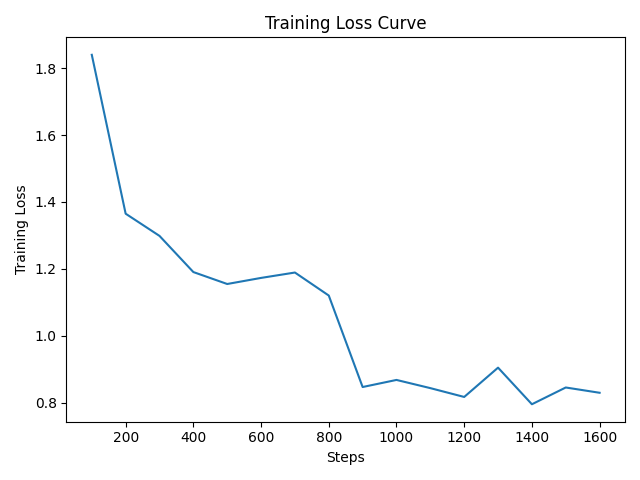

## 🤗 Hugging Face Link

[distilbert-reviews-genres on Hugging Face](https://huggingface.co/acinonyxxx/distilbert-reviews-genres)

---

## 🐳 Docker Commands

**Build:**
```bash
docker build -t mlops-ass3 .
```

**Run:**
```bash
docker run --rm -v $(pwd):/app mlops-ass3
```

**Train inside container:**
```bash
python train.py
```

---

## 📁 Repository Structure
```
Assignment-3/
├── train.py
├── evaluate.py
├── utils.py
├── Dockerfile.train
├── requirements.txt
├── training_loss.png
├── confusion_matrix.png
├── README.md
└── B23CM1060_Sonam_Sikarwar_Ass2.pdf   
```

---

## ⚙️ Hyperparameters

| Parameter | Value |
|-----------|-------|
| Model | `distilbert-base-cased` |
| Epochs | 2 |
| Train Batch Size | 8 |
| Eval Batch Size | 8 |
| Max Sequence Length | 512 |
| Evaluation Strategy | Per epoch |

---

## 📊 Final Evaluation Metrics

| Metric | Value |
|--------|-------|
| Accuracy | 0.71 |
| Precision | 0.7075 |
| Recall | 0.71 |
| F1 Score | 0.7080 |

---

## 📉 Training Loss Curve



> Loss decreased from **1.84** at step 100 down to **~0.83** by step 1600, showing stable convergence over 2 epochs.
